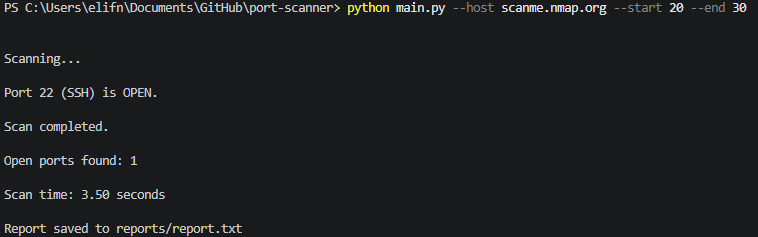

# Port Scanner

A Python-based TCP Port Scanner developed as a cybersecurity portfolio project.

This tool scans a target host for open TCP ports, identifies common services, performs basic banner grabbing, and generates a scan report.

---

## Features

- Scan TCP ports on a target host
- Scan a custom port range
- Detect open ports
- Identify common services (SSH, HTTP, HTTPS, etc.)
- Perform banner grabbing
- Measure scan duration
- Generate a scan report
- Command-line interface using argparse
- Built using Python Standard Library only

---

## Technologies

- Python 3
- socket
- argparse
- time
- Git
- GitHub

---

## Project Structure

```text
port-scanner/
│
├── images/
│   └── output.png
│
├── reports/
│   └── report.txt
│
├── main.py
├── scanner.py
├── report.py
├── README.md
├── requirements.txt
├── .gitignore
└── LICENSE
```

---

## Installation

Clone the repository

```bash
git clone https://github.com/elifnurtomaz/port-scanner.git
```

Go to the project directory

```bash
cd port-scanner
```

---

## Usage

Scan a target host

```bash
python main.py --host scanme.nmap.org --start 20 --end 100
```

Display help

```bash
python main.py --help
```

---

## Example Output

```text
Scanning...

Port 22 (SSH) is OPEN.
Banner:
SSH-2.0-OpenSSH_6.6.1p1 Ubuntu-2ubuntu2.13

Port 80 (HTTP) is OPEN.
Banner:
HTTP/1.1 200 OK

Scan completed.

Open ports found: 2

Scan time: 3.32 seconds

Report saved to reports/report.txt
```

---

## Screenshot



---

## Report Example

```text
PORT SCAN REPORT
========================================

Target: scanme.nmap.org

Port Range: 20-100

Open Ports:
- 22
- 80

Total Open Ports: 2

Scan Time: 3.32 seconds
```

---

## Future Improvements

- Multi-threaded scanning
- UDP port scanning
- IPv6 support
- JSON report export
- CSV report export
- Service version detection
- Progress indicator

---

## License

This project is licensed under the MIT License.

---

## Educational Purpose

This project was developed for learning Python, networking fundamentals, socket programming, and basic cybersecurity concepts.